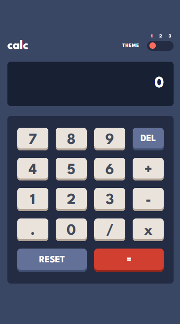
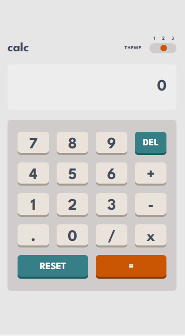
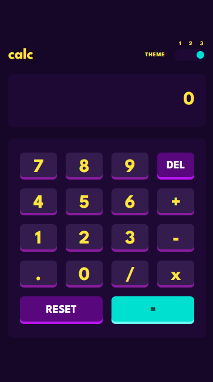

d<h1 align="center"> Calculator </h1>
 

    
    
    

## Features

### Theme Selector Feature

## Links

- Live Site URL: [Click Here](https://calculator-tan-phi.vercel.app/)

## Build With

- Scss
- Semantic HTML5
- Mobile-First Workflow
- Javascript
- Flexbox and CSS Grid
